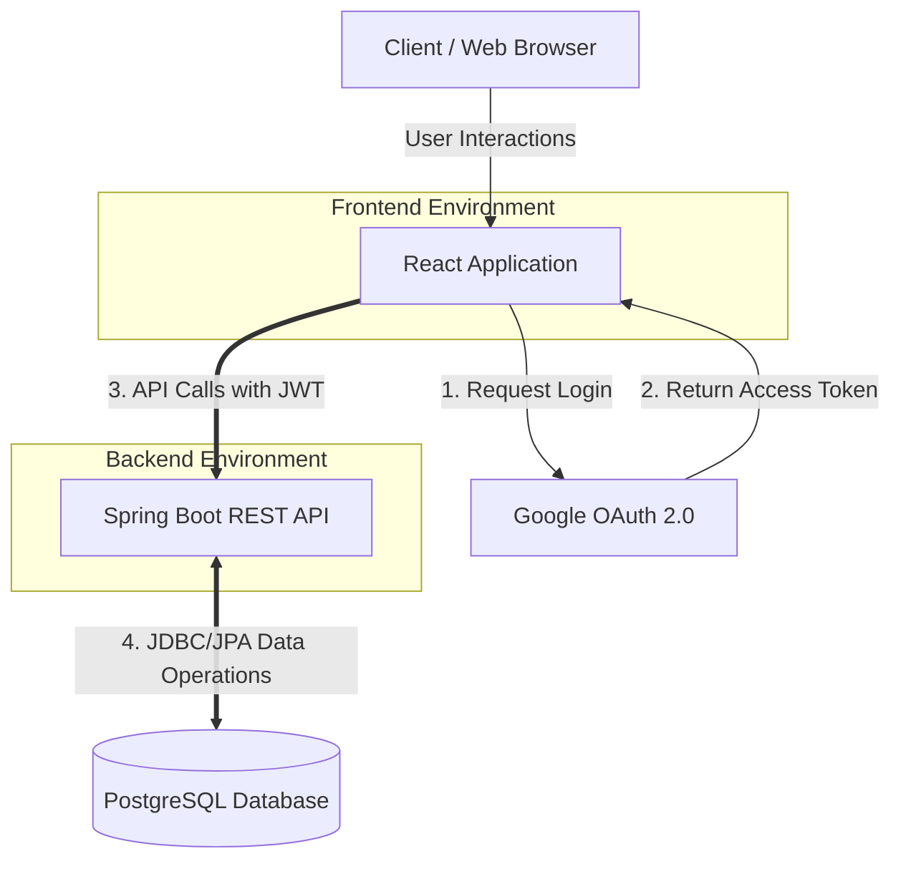
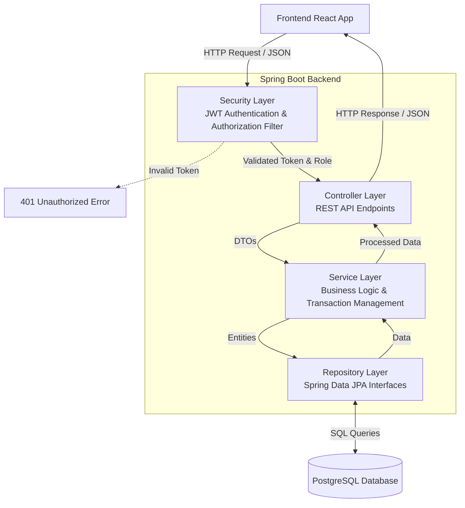
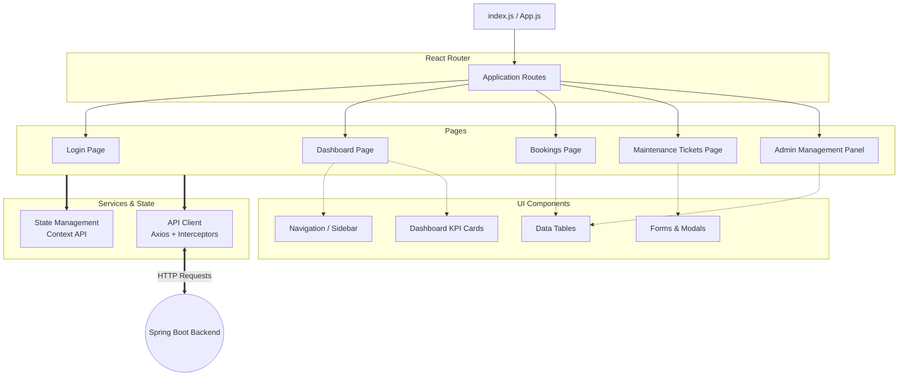

# Smart Campus Operations Hub - Diagram Structures

You can easily generate these diagrams in **Draw.io** by copying the Mermaid code below and using the Draw.io import feature:
1. Go to **Draw.io** (app.diagrams.net).
2. In the top menu, click **Arrange** -> **Insert** -> **Advanced** -> **Mermaid...**
3. Paste the code for the diagram you want and click **Insert**.

---

## 1. System Architecture
This shows the high-level interaction between the React frontend, Spring Boot backend, PostgreSQL database, and Google OAuth.

---

## 2. Backend Layered Architecture
This details the internal structure of the Spring Boot application, showing the flow from the security layer down to the database.

---

## 3. Frontend Architecture
This illustrates the React application structure, including routing, main pages, reusable components, and API service integration.

